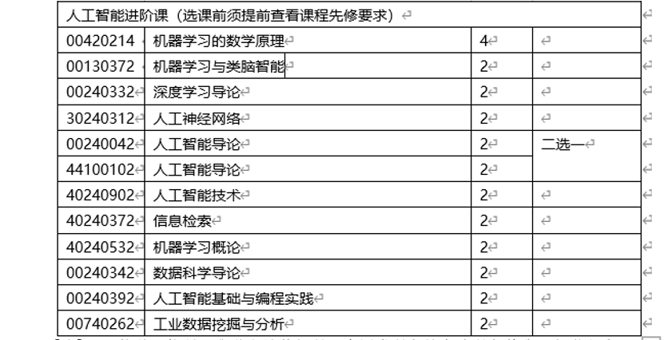

# FAQ - II. 科研实践

### 0) 正式参与生物信息科研课题之前该做哪些准备？ 

我们准备了一些可以参考和自学的材料，希望对大家有所帮助，为之后做科研实习甚至读博打好基础。

> 尤其是想做纯drylab课题的同学，建议完成下面的几件事之后再开始正式的科研实习课题。

**(a) 预修课程准备**

* 基本数学课程： 如《微积分》和《线性代数》
* 基本统计课程： 如《概率论》或《生物统计》
* 基本计算机课程：如《Linux》、《R》、《Python》等
* 基本生物课程： 如《普通生物学》《遗传学》或《分子生物学》
* 机器学习课程：如《机器学习》或《深度学习》
* 生物信息课程： 如《[生物信息学](https://lulab.life.tsinghua.edu.cn/ncrnalab/courses/)》（本科生课-春季学期）

> **清华大学Python 课程推荐 （三选一）：**
>
> * :star2:【推荐】 00310352 **基于Python的科学与数值计算**  2学分
> * 00740282 计算机程序设计基础 (Python)  2学分
> * 00740292 Python程序设计进阶  2学分

> **清华大学进阶人工智能课程推荐：**
>
>  

**(b) 文献阅读**
通过文献阅读了解我们实验室的研究方向，根据自己的基础和爱好，可以参阅 [Literature Reading - Startup](https://cloud.tsinghua.edu.cn/d/07d2b19d6b284ebea5ea/?p=%2F0.%20Startup&mode=list)

此外，更多的文献我整理放在了：[Tips for paper reading](../reading/reading.md)

**(c) Document your work** 

建议学会使用github和markdown语言，可以自己注册一个github账号，通过google等工具自己学习利用markdown语言，甚至可以利用github page构建一个自己的网页。
关于github和markdown，我们有一个简单的介绍：[Getting Started - Bioinformatics Tutorial](https://book.ncrnalab.org/teaching/getting-started)

**(d) 生物信息学的基本技能的学习**

具体可以参考我们的生物信息学教材：（ [https://bioinfo.gitbook.io/](https://bioinfo.gitbook.io/)）。该教材主要用于我给大家开的《[生物信息学](https://www.ncrnalab.org/courses/#bioinfo)》（本科生课-春季学期）。

* 注意熟悉三个计算机技能：Linux, R, Python 
* 有余力的话，还可以提前学习上述教材的PART I, II和III（不着急的话可以等入学后选修这门课）
* 还可以根据自己的基础学习教材里面推荐的一些其他参考内容（[Appendix I. Keep Learning - Bioinformatics Tutorial](https://book.ncrnalab.org/teaching/appendix/appendix1.keep-learning)）

### 1) 如何尽快融入到实验室的科研氛围中？

> "_Study while others are sleeping; work while others are loafing; prepare while others are playing; dream while others are wishing._"  - William A. Ward

要积极了解实验室的几个研究方向，认清自己的兴趣所在；闲暇时间要多和师兄师姐交流他们的科研经验，汲取精华，要多问 （当然很多问题可能GOOGLE更方便更高效）。总结下来就是要做到主动积极，勤学好问。

### 2) 导师、同学、同事之间如何交流科研课题的进展？ 

> “_I cannot teach anybody anything; I can only make them think._" - Socrates

**基本原则**： 导师对学生的时间应当尊重，不应当随性就微信索要实验结果或者分析结果；同样的，学生也应当尊重导师和其他同事的时间，有事情要讨论尽量提前预约。因此，除非事出紧急，email 交流重要而不紧急的事情会给彼此更多的空间和时间，大家的课题讨论和会议等交流方式也应当结构化。**事实上，绝大多数的重要的事情都不紧急，需要紧急回复的反而是形式化的琐事。**

* **Group Meeting:** sharing and talk practicing
* **Subgroup Meeting**: research results' report & discussion
* **WECHAT** (**urgent**: need answer **within 24 hours or less**)
* **EMAIL** (not urgent, need answer in a day or more)

> **“为什么国外把邮件(email)当微信一样发？**
>
> 邮件(email)办公最大的好处，是不会期待对方“秒回”，所以收件方有足够的时间去整理信息，有更多的弹性时间，即便周末收到也可以等到周一上班再回。 而且因为邮件“非即时性”的特点，发起邮件对话的一方（通常是老板、或者甲方）会对自己编写的信息更认真，会想清楚自己到底要布置什么任务才会发送， 不会像微信这种“即时性”软件一样，很多是突然兴起 。。。
>
> 所以，客观上邮件(email)是不方便的，但就是这种不方便反而利于劳动者， 这是对劳动者私人空间的尊重， 是对上/下班界限的明晰。”
>
> 李小粥@知乎

### 3) 组会和课题讨论小组会之间的差别是什么？

* 课题讨论小组会的形式随意，主要以讨论结果和细节为目的。 不论本科生还是研究生，做研究主要包括三块，汇报也是这三块：
  * （1）文献调研结论（对一个科学问题或者技术的调研和理解）
  * （2）湿实验结果
  * （3）干实验（数据分析）结果
* 组会报告要正式一些，每周一次，每个同学基本每学期会轮到一次的组会报告，以练习正式报告甚至是答辩报告的能力为目的，可以仿照“答辩ppt”的形式，包括I. Background, II. Method, III. Result, IV. Perspective (Future Plan)几个部分。

> 大家做完报告之后都鼓励ppt上传到清华云这个文件夹下（3a.PPT - Project Presentation），对于同一个课题的同学，实验内部默认background的slides是共享的，做报告的同学可以直接使用之前人做过（包括PI的）一些好的background slides，这样可以不断优化和积累background的slides。
>
> 清华云上还提供了一些正式的presentation的模板：4.Sharing - PPT and Poster Templates; 3.Thesis/优秀答辩ppt。

### 4) 更多

* [More Tips for Research](https://www.yinxiang.com/everhub/personal/336255) @_everhub_
