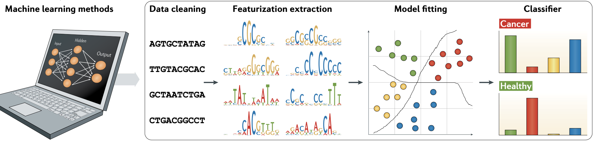

# Artificial Intelligence

!!!note "Note"
    * **Autoregressive Approach:**
    	* AlphaFold 2, _Nature_, 2021
    	* RoseTTAFold2, _bioRxiv_, 2023
    * **Diffusion Approach:**
    	* RFDiffusion, _Nature_, 2023
    	* RoseTTAFold All-Atom, _Science_, 2024
    	* AlphaFold 3 (All-Atom), _Nature_, 2024
    * **Foundation Models**:
    	* [**2024 Nature** ](https://www.nature.com/articles/s41586-024-07894-z)- A pathology foundation model for cancer diagnosis and prognosis prediction
    	* **\[RNA] 2024 Nature Machine Intelligence** - Multi-purpose RNA language modelling with motif-aware pretraining and type-guided fine-tuning
    	* **\[scRNA-seq]** [**2024 Nature Methods**](https://pubmed.ncbi.nlm.nih.gov/38844628/) - Large-scale foundation model on single-cell transcriptomics

**4 steps of Machine Learning**

