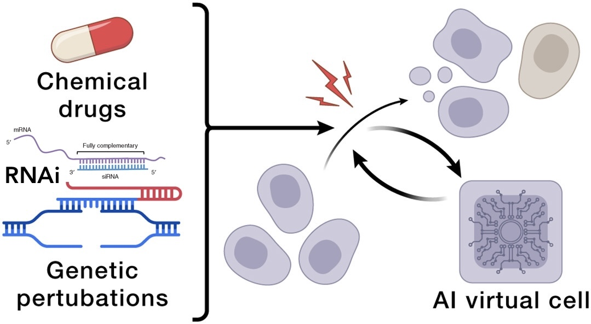

# AI for RNAi Screen (Therapy development in AIVC)

{:style="width: 39%; "}

## Topics/Projects

* siRNA prediction
      * **2024 Bioinformatics**  - OligoFormer: An accurate and robust prediction method for siRNA design. Bioinformatics [Lu Lab Paper]
* sRNA aptamer screen
      * 👍 **2026 Nature Biotechnology** - Single-round evolution of RNA aptamers with GRAPE-LM
      * **2010 Nature Review** \| Drug Discovery - Aptamers as therapeutics  
* Profiling cell --> Virtual cell
      * 👍[2026 **bioRxiv**](https://doi.org/10.1101/2025.11.13.688367) - Unified modeling of cellular responses to diverse perturbation types
      * **2021 Nature biotechnology** - Prediction of Drug Efficacy from Transcriptional Profiles with Deep Learning 
      * **2020 BIB** - Comprehensive evaluation of connectivity methods for L1000 data [Lu Lab Paper]
* Synergy 
      * **2025 Nature Communications** - Building a unified model for drug synergy analysis powered by large language models

## Screen Methods

* How to Write
    * **2022 Nature Review** - High-content CRISPR screening. 
    * **2012 PNAS** - Tiling genomes of pathogenic viruses identifies potent antiviral shRNAs and reveals a role for secondary structure in shRNA efficacy [Lu Lab Paper]
* How to Read
    * Interaction-seq (on-target & off-target)
        * 👍 **2023 Nature Biotech.** - Detection of transcriptome-wide microRNA–target interactions in single cells with agoTRIBE

