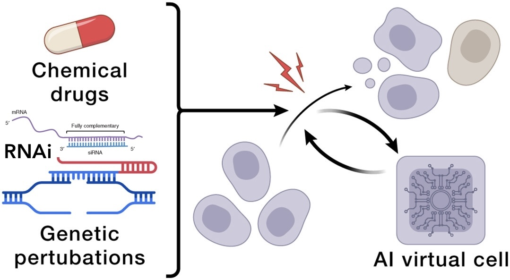

# AI for RNAi Screen (Therapy development in AIVC)

{:style="width: 39%; "}

## RNAi based AIVC (AI Virtual Cell)

**1. siRNA Design (on/off-target & Toxicity Prediction)**

* **2024 Bioinformatics** - OligoFormer: An accurate and robust prediction method for siRNA design. Bioinformatics [Lu Lab Paper]
* [**2010 Nature Review Drug Discovery**](https://www.nature.com/articles/nrd3010) - Recognizing and avoiding siRNA off-target effects for target identification and therapeutic application

**2. Drug Synergy Prediction** 

* [Transcriptional Profile]  [**2026 Cell**](https://www.cell.com/cell/fulltext/S0092-8674(26)00223-0)  - Deep-learning-based de novo discovery and design of therapeutics that reverse disease-associated transcriptional phenotypes.  [公众号介绍](https://mp.weixin.qq.com/s/-qFdtesx3XoqA4EQ5xMW1A)
* [Transcriptional Profile] **2021 Nature biotechnology** - Prediction of Drug Efficacy from Transcriptional Profiles with Deep Learning
* 👍 [Synergy] **2025 Nature Communications** - Building a unified model for drug synergy analysis powered by large language models
* 👍 [Synergy] [**2023 Nature Biotechnology**](https://doi.org/10.1038/s41587-023-01905-6) - Predicting transcriptional outcomes of novel multigene perturbations with GEARS

**3. AIVC** 

* 👍 [AIVC Perspective] **2024 Cell** - How to build the virtual cell with artificial intelligence - Priorities and opportunities
* [Resources of Perturbation Datasets] [**2026 bioRxiv**](https://doi.org/10.1101/2025.11.13.688367) - Unified modeling of cellular responses to diverse perturbation types

## Screen Methods (Wetlab) for RNAi based AIVC

**How to Read** (Total RNA-seq)

* 👍 TotalX (Total RNA-seq) [**2026 NBT**](https://doi.org/10.1038/s41587-026-03068-6) - Scalable single-cell total RNA sequencing unifies coding and noncoding transcriptomics.   [公众号介绍](https://mp.weixin.qq.com/s/urR7dM6-S5i8ZCp9RiECDw)
* 👍 VASA-seq (Total RNA-seq) **2022 NBT** - High-throughput total RNA sequencing in single cells using VASA-seq
* DETECTOR-seq **2024 Clin. & Trans. Med.** - Depletion-assisted multiplexed cell-free RNA sequencing reveals distinct human and microbial signatures in plasma versus extracellular vesicles [Lu Lab Paper]
*  TRIBE (Interaction-seq) **2023 Nature Biotech.** - Detection of transcriptome-wide microRNA–target interactions in single cells with agoTRIBE

**How to Write** (High-throughput Perturbation)

* 👍 **2025 Nature Biotechnology** - Pooled CRISPR screens with joint single-nucleus chromatin accessibility and transcriptome profiling
* 👍 **2026 Cell** - CRISPR screens identify targets to rescue age-related T cell dysfunction in cancer
* **Screen Method Introduction**
     * **2022 Nature Review** - High-content CRISPR screening. 
     * **2012 PNAS** - Tiling genomes of pathogenic viruses identifies potent antiviral shRNAs and reveals a role for secondary structure in shRNA efficacy [Lu Lab Paper]

**Novel small RNA (Aptamer) Drug Screen/Discovery**

* [Aptamer] **2026 Nature Biotechnology** - Single-round evolution of RNA aptamers with GRAPE-LM
* [Aptamer] **2010 Nature Review** \| Drug Discovery - Aptamers as therapeutics 

  