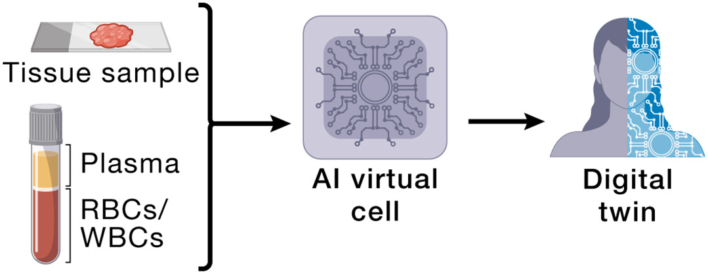
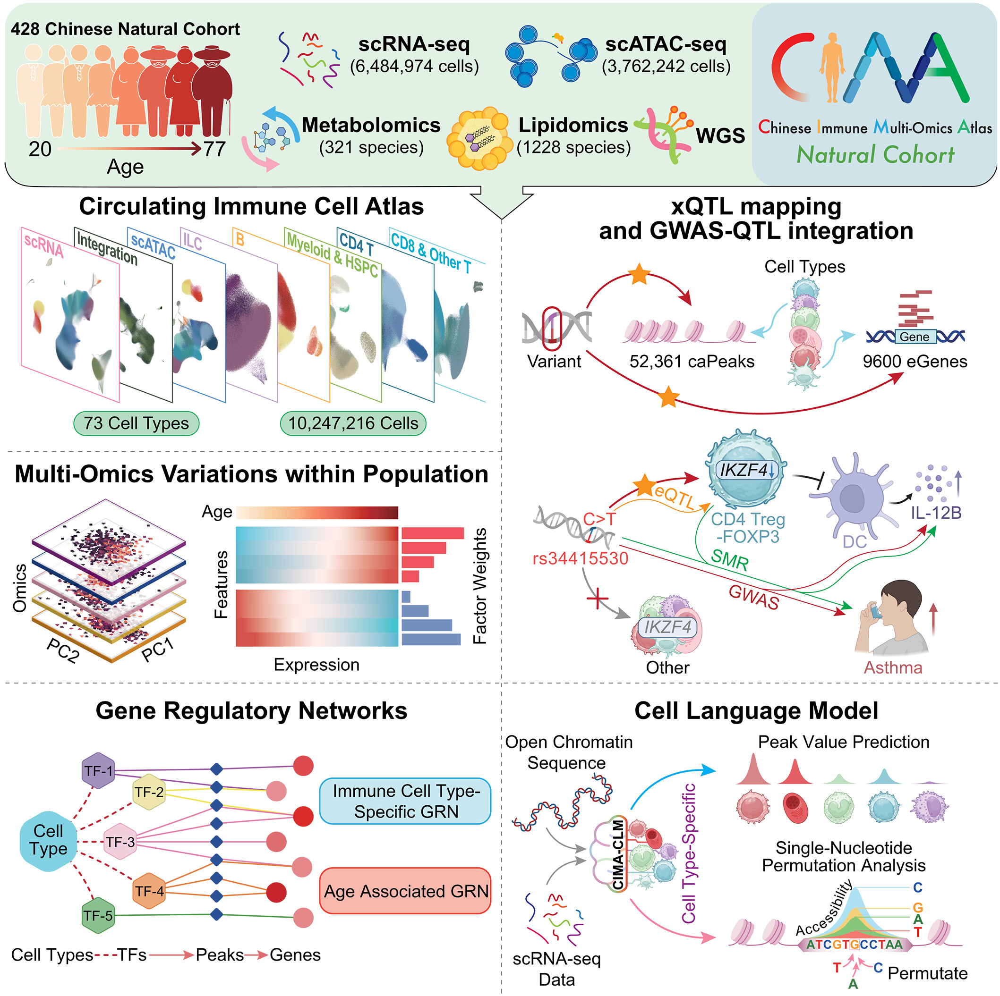

# AI for RNAtalk - RNA Centered Interactome & Virtual Cell (AIVC)

{:style="width: 39%; "}

## RNA Centered Interactome (RNAtalk) in Brain

* Roadmap of AI
    * 👍 [**2025 Nature Reviews**](https://www.nature.com/articles/s41580-025-00857-w) - Decoding the interactions and functions of non-coding RNA with artificial intelligence
* Data for AI: Seq-tech
    * 👍 VASA-seq **2022 NBT** - High-throughput total RNA sequencing in single cells using VASA-seq
    * DETECTOR-seq **2024 Clin. & Trans. Med.** - Depletion-assisted multiplexed cell-free RNA sequencing reveals distinct human and microbial signatures in plasma versus extracellular vesicles [Lu Lab Paper]
    * 👍 MUSIC **2024 Nature** - Single-cell multiplex chromatin and RNA interactions in ageing human brain
    * RIC-seq **2020 Nature** - RIC-seq for global in situ profiling of RNA–RNA spatial interactions 

## MultiOmics --> AIVC (a multimodal model) in Medicine & Brain Studies

* MultiOmics Methods
    * 2024 **Nature Methods**  - Benchmarking algorithms for single-cell multi-omics prediction and integration
    * 2023 **Nature Methods** - SCENIC+: single-cell multiomic inference of enhancers and gene regulatory networks
* Foundation Models
    * 2025 **Nature Methods** - EpiAgent: foundation model for single-cell epigenomics
    * 2024 **Nature Methods** - Large-scale foundation model on single-cell transcriptomics
* AIVC studies
    * [2026 **bioRxiv**](https://doi.org/10.1101/2025.11.13.688367) - Unified modeling of cellular responses to diverse perturbation types
    * Read more about **Digital Twin** for Medicine

{:style="float:left; margin-right:12px; width: 20%; "}
>
> **MultiOmics Analysis Examples**:
>
> Chinese Immune Multi-Omics Atlas
>
> *Science* 2026 
>
>

---

## More: 

### [RNA-Protein] RBP & Post-transcriptional Regulation

* 2025 **Nature biotechnology** - A resource of RNA-binding protein motifs across eukaryotes reveals evolutionary dynamics and gene-regulatory function
* 2015 **Nature Biotech.** - DeepBind: Predicting the sequence specificities of DNA- and RNA-binding proteins by deep learning
* POSTAR3 - **NAR** 2022  [Lu Lab Paper]
* RBPgroup - **Genome Biology** 2017 [Lu Lab Paper]