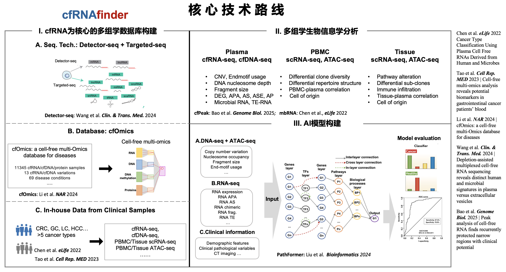

# AI for cell-free RNA (cfRNA)

{:style="width: 39%; "}

## I. cfRNA

* [2025 **Nature Machine Intelligence**](https://doi.org/10.1038/s42256-025-01148-x) - A multimodal cell-free RNA language model for liquid biopsy applications
* 2025 **Nature** - An ultrasensitive method for detection of cell-free RNA
* 2025 **Genome Biology** - Peak analysis of cell-free RNA finds recurrently protected narrow regions with clinical potential [Lu Lab Paper]
* 2023 **Nature BME** - Nature Profiling of repetitive RNA sequences in the blood plasma of patients with cancer 
* 2022 **eLife** - Cancer Type Classification Using Plasma Cell Free RNAs Derived from Human and Microbes  [Lu Lab Paper]
* [Representative cfRNA Studies](../../A.RNAfinder/1.1%20cfRNAfinder/2.%20cfRNA/#i-representative-cfrna-studies)

## II. cfRNA - microbiome in blood

* Virome & AI
    * 2025 **Nature Genetics** - Blood DNA virome associates with autoimmune diseases and COVID-19 
    * 2024 **Cell** - Using Artificial Intelligence to Document the Hidden RNA Virosphere
* cfRNA-microbial reads
    * 2025 **Nature Biotechnology** - Modifications of microbiome-derived cell-free RNA in plasma discriminates colorectal cancer samples
    * 2022 **eLife** - Cancer Type Classification Using Plasma Cell Free RNAs Derived from Human and Microbes  [Lu Lab Paper]
    * 2020 **Nature** - *RETRACTED ARTICLE:* Microbiome analyses of blood and tissues suggest cancer diagnostic approach
        * **concerns:** Gihawi, A. et al. Major data analysis errors invalidate cancer microbiome findings. mBio 14, e01607–23 (2023)
        * **response:** Sepich-Poore, G. D. et al. Robustness of cancer microbiome signals over a broad range of methodological variation. Oncogene 43, 1127–1148 (2024).

